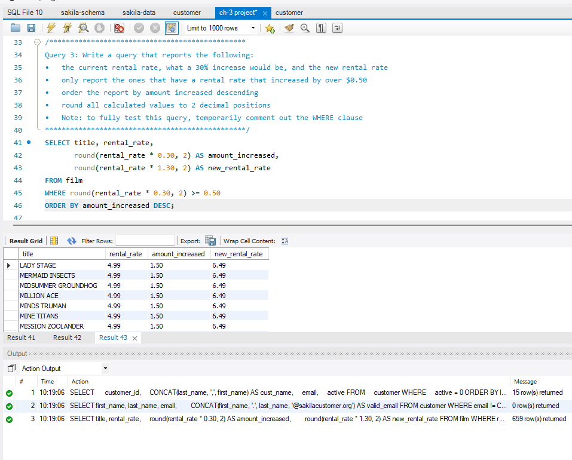
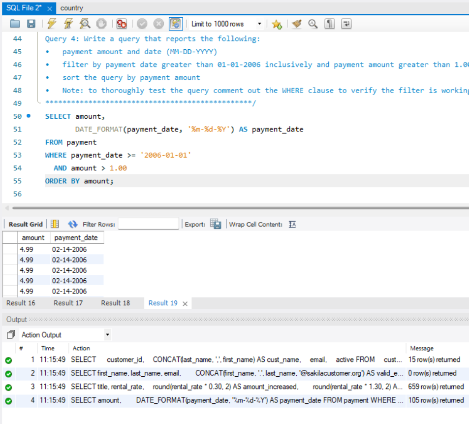
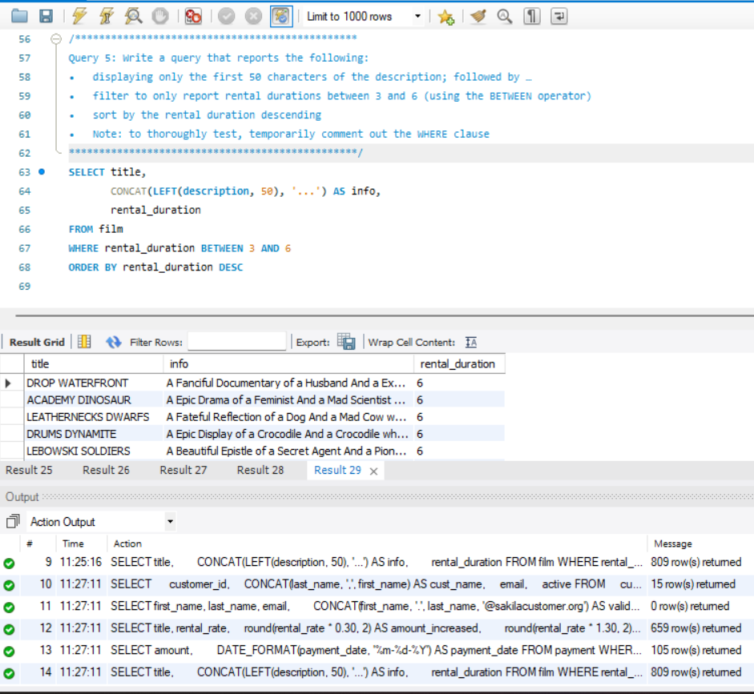
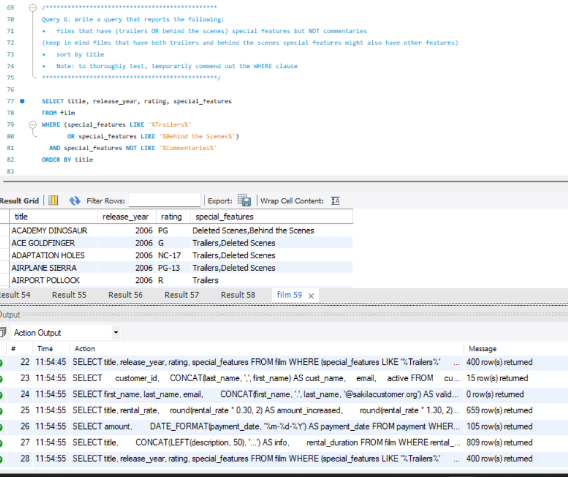

# MySQL_Ch3_SingleTableQueries

Welcome! This project uses single-table queries on the Sakila database to practice the SQL concepts in Chapter 3.

---

## Project Overview

This project demonstrates how to:
- Retrieve selected columns from one table
- Calculate and round values with column aliases
- Combine and shorten text with `CONCAT` and `LEFT`
- Format payment dates with `DATE_FORMAT`
- Filter rows with `WHERE`, comparison operators, `BETWEEN`, and logical operators
- Sort query results with `ORDER BY`

The SQL queries are in [Ch_3](Ch_3).

---

## Technologies Used
- MySQL
- Sakila sample database
- MySQL Workbench

---

## Features

- Lists inactive customers
- Checks customer email addresses against the required format
- Calculates a 30% film rental-rate increase
- Filters and formats payments
- Shortens film descriptions and filters rental duration
- Finds films with selected special features

---

## New Concepts Used

`SELECT`, column aliases, arithmetic expressions, `ROUND`, `CONCAT`, `LEFT`, `DATE_FORMAT`, `WHERE`, `BETWEEN`, `LIKE`, `AND`, `OR`, and `ORDER BY`.

---

## Console Output Testing Example

### Query 1

### Query 2

### Query 3

### Query 4

### Query 5

### Query 6

---

## Author

**Jay Meesala**  
GitHub: [@shakoooni](https://github.com/shakoooni)
